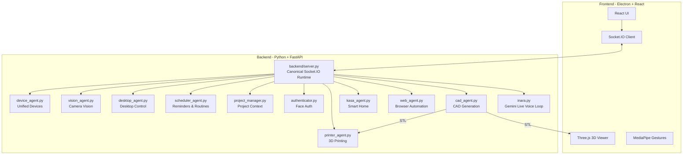

```
  ___  _  _    _    ___    _
 |_ _|| \| |  /_\  | _ \  /_\
  | | | .` | / _ \ |   / / _ \
 |___||_|\_|/_/ \_\|_|_\/_/ \_\
-=It's Not A Random Acronym=-
```


> Your own AI that lives on your desktop, controls your house, designs your parts, runs your browser, and prints your prototypes - all by voice.

> Supported runtime: `electron/main.js -> backend/server.py`. The `backend/core/` server refactor is archived reference code and is not the active app backend.

INARA is a modular AI agent platform built for real-world control. Not a chatbot. Not a wrapper around an API. A system with eyes, ears, hands, and opinions.

You can talk to it and get a response. Ask it to design a gear and it can create a 3D model, prepare it for printing, and send it to your printer. Tell it to dim the lights and it handles it. Ask it to look something up on Amazon and it opens a browser and searches for you.


---

## What It Can Do

| Feature                  | Description                                                    | Tech                             |
| ------------------------ | -------------------------------------------------------------- | -------------------------------- |
| 🗣️ **Real-Time Voice**   | Low-latency conversation with interrupt handling and wake word | Gemini Native Audio              |
| 🧊 **Parametric CAD**    | Generate and iterate 3D models from natural language           | `build123d` -> STL               |
| 🖨️ **3D Print Pipeline** | Auto-slice and send to printers over your network              | OrcaSlicer + Moonraker/OctoPrint |
| 🖐️ **Gesture Control**   | Minority Report-style window manipulation via hand tracking    | MediaPipe                        |
| 🌐 **Web Agent**         | Autonomous browser - navigates, clicks, types, reads           | Playwright + Chromium            |
| 🏠 **Smart Home**        | Voice control for TP-Link Kasa + Home Assistant devices        | `python-kasa`, HA REST API       |
| 👁️ **Face Auth**         | Biometric login - local only, nothing leaves your machine      | MediaPipe Face Landmarks         |
| 📁 **Project Memory**    | Persistent context across sessions and conversations           | File-based storage               |
| ⏰ **Reminders**         | Voice-set reminders and recurring routines that fire on cue    | File-backed store                |
| 🖥️ **Desktop Control**   | Launch apps, take screenshots, search files, read clipboard    | `psutil`, `pyperclip`            |
| 📷 **Camera Vision**     | Describe scenes, detect presence, watch for conditions         | Gemini Vision                    |

### 🖐️ Gesture Control

INARA's Minority Report interface uses your webcam for hands-free window control:

| Gesture            | Action                    |
| ------------------ | ------------------------- |
| ✊ **Closed Fist** | Grab and drag a UI window |
| 🤏 **Pinch**       | Confirm / click           |
| ✋ **Open Palm**   | Release                   |

### 🔮 Coming Soon

| Module                        | Description                                                         |
| ----------------------------- | ------------------------------------------------------------------- |
| 📞 **Phone Calls**            | Outbound/inbound call handling through voice                        |
| 📅 **Calendar Integration**   | Time-aware scheduling synced to external calendars                  |
| 🔌 **Matter / Thread**        | Next-gen smart home protocol support                                |
| 🎤 **Custom Wake Word**        | Train a personal wake phrase instead of a button press              |
| 🔊 **Multi-Room Audio**        | Route voice and playback across rooms                               |

---

## 🏗️ Architecture

Current supported runtime:

- Electron launches `backend/server.py`
- `backend/server.py` owns the active Socket.IO contract used by the React app
- `backend/core/` is an archived experimental refactor and is not used by `npm run dev`



The repository still contains an unfinished event-bus rewrite under `backend/core/`, but the supported runtime and active backend contract live in `backend/server.py`.

---

## ⚡ Quick Start

### Prerequisites

- Python 3.11+
- Node.js 18+

### Setup

```bash
# Clone
git clone https://github.com/Herorif/inara.git && cd inara

# Python environment
python -m venv .venv

# Activate (pick your OS)
# Linux/macOS:
source .venv/bin/activate
# Windows:
.venv\Scripts\activate

# macOS only - required for PyAudio
# brew install portaudio

# Dependencies
pip install -r requirements.txt
playwright install chromium

# Frontend
npm install

# API keys
echo "GEMINI_API_KEY=your_key_here" > .env
```

### 🚀 Run

**Single command:**

```bash
npm run dev
```

**Or split terminals (recommended - you'll want to see the logs):**

```bash
# Terminal 1 - Backend
python backend/server.py

# Terminal 2 - Frontend
npm run dev
```

Manual backend shortcut:

```bash
npm run backend:dev
```

> Make sure your venv is activated in any terminal that runs Python.

---

## ✅ First Flight Checklist

Once it's running, try these:

1. 🗣️ **Voice** - Say "Hello INARA". She should respond.
2. 👁️ **Face Auth** - Look at the camera. If enabled, the lock screen should unlock.
3. 🧊 **CAD** - Open the CAD window and say "Create a cube". Watch it generate.
4. 🌐 **Web** - Open the Browser window and say "Go to Google".
5. 🏠 **Smart Home** - If you have Kasa devices, say "Turn on the lights".
6. 🖨️ **Print** - Generate a model, then say "Print it".
7. ⏰ **Reminders** - Say "Remind me to stretch in 5 minutes". It fires and announces.
8. 🖥️ **Desktop** - Open the Desktop window. Click the lightning bolt to pull system stats.
9. 📷 **Vision** - Open the Vision window. Type "person at door" and add a watch condition.

---

## ⚙️ Configuration

Settings live in `backend/settings.json` (auto-created on first run).

| Key                              | Type    | Description                                       |
| -------------------------------- | ------- | ------------------------------------------------- |
| `face_auth_enabled`              | `bool`  | Require face recognition before interaction       |
| `tool_permissions.generate_cad`  | `bool`  | Require confirmation before CAD generation        |
| `tool_permissions.run_web_agent` | `bool`  | Require confirmation before browser automation    |
| `tool_permissions.write_file`    | `bool`  | Require confirmation before writing files to disk |
| `tool_permissions.launch_app`    | `bool`  | Require confirmation before launching applications |
| `tool_permissions.control_device`| `bool`  | Require confirmation before toggling smart devices |
| `tool_permissions.watch_for`     | `bool`  | Require confirmation before starting camera watch  |
| `printers`                       | `array` | Saved printer configurations                      |
| `kasa_devices`                   | `array` | Saved smart home devices                          |

### 🔑 API Keys

Create a `.env` file in the project root:

```env
GEMINI_API_KEY=your_gemini_key
ANTHROPIC_API_KEY=your_claude_key
# Optional — only needed if using Home Assistant integration
HA_URL=http://homeassistant.local:8123
HA_TOKEN=your_long_lived_access_token
```

- Gemini key -> [Google AI Studio](https://aistudio.google.com/app/apikey)
- Claude key -> [Anthropic Console](https://console.anthropic.com/)

---

## 🔧 Hardware Setup

### 🖨️ 3D Printers

Supports **Klipper/Moonraker**, **OctoPrint**, and **PrusaLink**. Printers are auto-discovered via mDNS on your local network, or can be added manually by IP.

Requires [OrcaSlicer](https://github.com/SoftFever/OrcaSlicer) installed for slicing. INARA auto-detects the installation path and selects the right profile based on your printer model.

### 🏠 Smart Home

TP-Link Kasa devices are discovered automatically on your network. Control lights (on/off, brightness, color), plugs, and switches - by voice or through the UI.

### 🔐 Face Authentication

1. Take a clear photo of your face.
2. Save it as `reference.jpg` in the `backend/` directory.
3. Toggle with `face_auth_enabled` in settings.

All processing is local. Nothing is uploaded. Nothing is stored externally.

---

## 📂 Project Structure

```
inara/
├── backend/
│   ├── core/                  # Event bus, reminder store, config, tool registry
│   ├── llm/                   # LLM abstraction (Gemini, Claude, router)
│   ├── agents/                # Agent modules (CAD, web, printer, kasa, scheduler, desktop, vision, device)
│   ├── desktop/               # System monitor, app registry, screen capture
│   ├── vision/                # Vision loop (continuous camera watch conditions)
│   ├── devices/               # Home Assistant bridge
│   ├── voice/                 # Voice pipeline (STT, TTS, VAD, audio I/O)
│   ├── inara.py               # Voice integration (Gemini Live API)
│   ├── server.py              # Canonical Socket.IO runtime
│   ├── printer_agent.py       # Printer discovery & slicing engine
│   ├── kasa_agent.py          # Kasa device control engine
│   ├── cad_agent.py           # CAD generation engine
│   ├── authenticator.py       # Face auth engine
│   └── project_manager.py     # Project context management
├── src/                       # React frontend
│   ├── App.jsx                # Main application shell
│   ├── store/                 # Zustand slices (chat, cad, kasa, reminders, desktop, vision, devices…)
│   └── components/            # UI components (windows, visualizer, tools panel…)
├── electron/                  # Electron main process
│   └── main.js                # Window & IPC setup
├── tests/                     # Test suite
├── .env                       # API keys (create this)
├── requirements.txt           # Python dependencies
├── package.json               # Node.js dependencies
└── README.md
```

---

## 🔒 Security

| Aspect                 | Implementation                                  |
| ---------------------- | ----------------------------------------------- |
| **API Keys**           | Stored in `.env`, excluded from version control |
| **Face Data**          | Processed locally, never transmitted            |
| **Tool Confirmations** | Write/CAD/Web actions can require user approval |
| **Project Data**       | Everything stays on your machine                |

> Never share your `.env` file or `reference.jpg`. These contain credentials and biometric data.

---

## 🤝 Contributing

1. Fork the repo
2. Create a feature branch: `git checkout -b feature/your-feature`
3. Commit your changes
4. Open a pull request with a clear description

---

## 📄 License

Copyright 2026 Harif

This project is licensed under the MIT License. See [LICENSE](LICENSE) for details.

---

<p align="center">
  <strong>Built by Herorif</strong><br>
  <em>I love you 3000</em>
</p>
