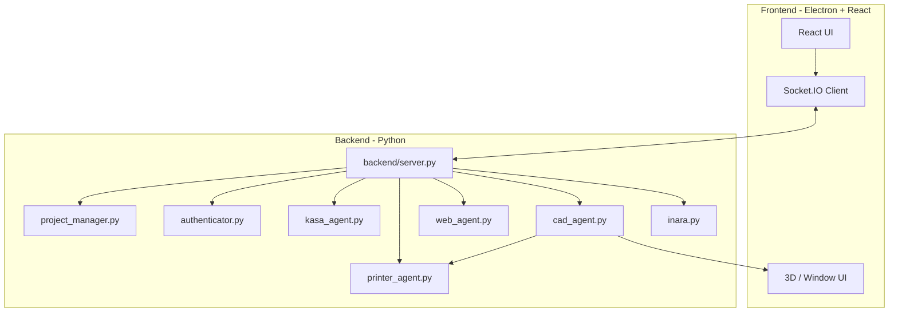

```
  ___  _  _    _    ___    _
 |_ _|| \| |  /_\  | _ \  /_\
  | | | .` | / _ \ |   / / _ \
 |___||_|\_|/_/ \_\|_|_\/_/ \_\
 -= It's Not A Random Acronym =-
```


> Windows-first desktop AI operator for voice, CAD, browser automation, printers, and local devices.

> Supported runtime: `electron/main.js -> backend/server.py`
>
> `backend/core/` is archived experimental reference code. It is not the active app backend and is not used by `npm run dev`.

INARA is a local-first Electron + React desktop app backed by a Python Socket.IO server. The current app is centered around a live Gemini-driven voice session, CAD generation, browser automation, printer control, smart-home discovery, and project-scoped state. It is not a generic framework in its current shipped form; it is a Windows-first personal operator focused on real local tooling.


---

## Current Status

### Working Now

- Desktop app shell with Electron + React UI
- Canonical backend runtime in `backend/server.py`
- Explicit backend / AI / local-device connection states in the UI
- Gemini-backed voice session startup and control
- CAD generation and iteration flows
- Browser automation through the web agent
- Printer discovery, saved-printer loading, offline status handling, slicer-status reporting
- TP-Link Kasa device discovery and control plumbing
- Project-scoped chat and CAD artifact storage
- Manual smoke coverage for the legacy desktop runtime

### Working With Optional Setup

- AI features require a valid `GEMINI_API_KEY`
- Printing requires OrcaSlicer or PrusaSlicer plus reachable printers
- Face authentication requires `backend/reference.jpg` and enabled settings
- Smart-home features require reachable local Kasa devices
- Hand-tracked UI control requires webcam access and MediaPipe runtime support

### Partial / Experimental

- Phone / telephony flows exist in the repo but are not the primary tested path
- Reminders, vision, desktop tooling, and unified device control exist but are not documented here as fully productized features
- `backend/core/` contains an unfinished event-bus rewrite that is intentionally quarantined from the supported runtime

---

## What INARA Does

- Starts a desktop UI and local backend for controlling AI and device workflows from one place
- Runs a Gemini-backed voice session for conversational commands when AI is enabled
- Generates and iterates parametric CAD models, then previews and routes them toward printing
- Discovers printers, reports slicer readiness, monitors offline/online status, and submits print jobs
- Runs a Playwright-based browser agent for guided or autonomous web tasks
- Discovers and controls Kasa devices on the local network
- Stores project context and long-term memory artifacts on disk

---

## Architecture

Current supported runtime:

- Electron launches `backend/server.py`
- `backend/server.py` owns the active Socket.IO contract used by the React app
- `inara.py` handles the Gemini live voice loop
- Local printer and device features can remain available even when AI is unavailable



Archived refactor:

- `backend/core/` remains in the repository as reference material only
- it is blocked from accidental startup unless `INARA_ALLOW_EXPERIMENTAL_CORE_SERVER=1` is set

---

## Quick Start

### Prerequisites

- Python 3.11+
- Node.js 18+
- Windows is the primary target environment

### Setup

```bash
# Clone
git clone https://github.com/Herorif/inara.git
cd inara

# Python environment
python -m venv .venv

# Activate
# Linux/macOS:
source .venv/bin/activate
# Windows:
.venv\Scripts\activate

# Python dependencies
pip install -r requirements.txt

# Browser automation runtime
playwright install chromium

# Frontend
npm install
```

Create `.env` in the project root:

```env
GEMINI_API_KEY=your_gemini_key
```

Notes:

- A missing or invalid Gemini key disables AI features cleanly
- Local printer and device UI can still be available without a working Gemini key

### Run

Single command:

```bash
npm run dev
```

Manual backend command:

```bash
npm run backend:dev
```

Split terminals:

```bash
# Terminal 1
python backend/server.py

# Terminal 2
npm run dev
```

---

## First Checks

After startup, confirm:

1. Electron reports the canonical backend runtime.
2. The backend startup banner prints Gemini status, face-auth status, slicer status, and saved-printer count.
3. The app opens idle instead of auto-starting AI.
4. The top bar shows separate backend, AI, and local-device status badges.

Then try:

1. Press the power button to start the AI session.
2. Open the CAD window and generate a simple model.
3. Open the printer window and confirm slicer / printer status.
4. Open the smart-home window and trigger discovery if you use Kasa devices.
5. Run a simple web-agent task if Gemini is configured.

---

## Configuration

Runtime configuration lives in:

- `.env`
- `backend/settings.json`

Important settings:

- `face_auth_enabled`
- `tool_permissions`
- `printers`
- `kasa_devices`
- `camera_flipped`

Face authentication:

1. Put a clear face image at `backend/reference.jpg`
2. Enable `face_auth_enabled`
3. If face auth is disabled, the app skips the reference-image requirement

Printers:

- Supported printer families include Moonraker / Klipper, OctoPrint, and PrusaLink flows in the codebase
- Printing requires OrcaSlicer or PrusaSlicer to be installed
- Saved printers load at backend startup and may show offline when unreachable

Smart home:

- Kasa devices are discovered from the local network and persisted back into `backend/settings.json`

---

## Current Limitations

- AI-dependent features do not work without a valid `GEMINI_API_KEY`
- Browser automation and CAD generation are still tied to Gemini availability
- Printing is unavailable without a detected slicer installation
- Printers can remain listed while offline; that is expected behavior now
- Some subsystems in the repo are broader than the currently hardened app path
- `backend/core/` is not a supported runtime and should not be treated as the source of truth for the desktop app

---

## Testing

Automated smoke coverage for the supported runtime:

```bash
python -m unittest tests.test_legacy_runtime_smoke -v
```

Or through the test runner:

```bash
python tests/test_runner.py --module=smoke
```

Frontend build check:

```bash
npm run build
```

Manual runtime checklist:

- See [tests/legacy_runtime_manual_checklist.md](tests/legacy_runtime_manual_checklist.md)

What the smoke suite covers:

- invalid Gemini-key startup summary
- `discover_kasa`
- `discover_printers`
- legacy web-agent prompt path
- `save_memory`
- archived `backend/core/server.py` quarantine

---

## Project Structure

```text
inara/
|-- backend/
|   |-- server.py              # Canonical desktop backend runtime
|   |-- inara.py               # Gemini live voice loop
|   |-- cad_agent.py           # CAD generation and iteration
|   |-- web_agent.py           # Browser automation
|   |-- printer_agent.py       # Printer discovery / slicing / printing
|   |-- kasa_agent.py          # TP-Link Kasa integration
|   |-- authenticator.py       # Face-auth flow
|   |-- project_manager.py     # Project context and artifact storage
|   `-- core/                  # Archived experimental refactor
|-- electron/
|   `-- main.js                # Electron entrypoint
|-- src/                       # React frontend
|-- tests/                     # Smoke and module tests
|-- package.json
|-- requirements.txt
`-- README.md
```

---

## Security

- API keys live in `.env` and should never be committed
- Face-auth reference images stay local
- Tool permissions can require confirmation for sensitive actions
- Project data and saved memory stay on the local machine unless you explicitly export or share them

Do not share:

- `.env`
- `backend/reference.jpg`
- local project data you do not intend to publish

---

## Contributing

1. Fork the repo
2. Create a branch
3. Make and verify your changes
4. Open a pull request with a clear summary

---

## License

Copyright 2026 Harif

This project is licensed under the MIT License. See [LICENSE](LICENSE) for details.

---

<p align="center">
  <strong>Built by Herorif</strong><br>
  <em>I love you 3000</em>
</p>
